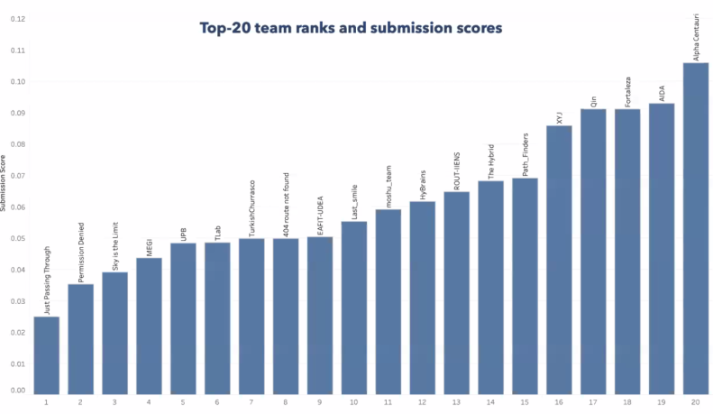

# LMRRC-Proceedings-AIDA

Repository for the codes used by team AIDA in the Amazon Last Mile Routing Research Challenge (2021).

## Outline

The proposal intended to be made as simple as possible, within the perspective of Less Is More Principle.
It was able to achieve a nice result, performing within the top 20 best candidates.

# Data

Should contain the data used in all solver. The data should be follow the correct [data structures](/data_structures.md) for the work properly.

# src
Contains the [makefile](/src/makefile). Run the command `make` from the folder to compile the solver.

## heuristic

### OptAMZ.hpp
- Contains the context, evaluation, neighborhood searches, etc

### newmainAMZ.cpp;
- Code that compiles the solver, which is tuned for a machine with 16 cores and 64GB ram.

## featurescpp
- Features loader and container.

## build
- Folder that stores the compiled solver.

# Running the solver
To run the solver, first compile it by running `make` inside `/src`, then run the compiled program with the data inside `/data`.